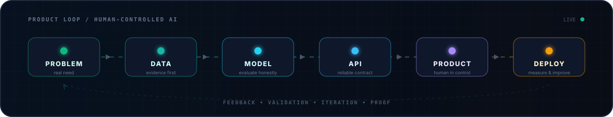

<div align="center">



<br />

<a href="https://anas-portfolio-pro.vercel.app/"></a>
<a href="https://www.linkedin.com/in/anas-lahraoui-a772a5300/"></a>
<a href="mailto:anas.lahraoui@usms.ac.ma"></a>

</div>

<br />

<table>
<tr>
<td width="58%" valign="top">

## 01 // IDENTITY

I am **Anas Lahraoui**, a Computer Science and Artificial Intelligence graduate from Université Sultan Moulay Slimane in Morocco.

I do not want AI work to stop at model accuracy. I build the system around the model: **data, validation, APIs, interfaces, deployment, and a product people can actually use.**

My strongest hands-on areas are **Machine Learning, Deep Learning, Computer Vision, and AI-powered full-stack products**.

</td>
<td width="42%" valign="top">

## LIVE SYSTEM

```text
ROLE       AI Product Engineer
LOCATION   Khouribga, Morocco
EDUCATION  Licence SIIA ✓
NEXT       Master in AI · 09/2026
MODE       Build → Test → Ship
STATUS     Open to opportunities
```

</td>
</tr>
</table>

---

## 02 // HOW I SHIP AI

<div align="center">



</div>

> **My rule:** a model becomes valuable only when it is connected to a real problem, trustworthy data, a usable interface, and a measurable outcome.

---

## 03 // FEATURED SYSTEMS

<table>
<tr>
<td width="50%" valign="top">

### 01. [ProofFolio AI](https://github.com/anabkl/ProofFlio-ai)

**Evidence-first career infrastructure**

Turns CV material, GitHub repositories, certificates, and project evidence into recruiter-ready public portfolios with user-controlled review and publishing.

`Next.js` `TypeScript` `Supabase` `Product UX`

[Live product](https://proof-flio-ai.vercel.app/) · [Source](https://github.com/anabkl/ProofFlio-ai)

</td>
<td width="50%" valign="top">

### 02. [Sahtek](https://github.com/anabkl/Sahtek.tech)

**Darija-first health awareness platform**

A multilingual Moroccan PWA combining guided education, privacy-first local flows, an AI assistant, reminders, and doctor discovery.

`React` `TypeScript` `PWA` `AI Integration`

[Live product](https://sahtek.tech) · [Source](https://github.com/anabkl/Sahtek.tech)

</td>
</tr>
<tr>
<td width="50%" valign="top">

### 03. [FPK-EXPRESS](https://github.com/anabkl/FPK-EXPRESS)

**A campus product built from field evidence**

Preorder and pickup workflows for students and vendors, shaped by a survey of **23 FPK Khouribga students** and backed by a full-stack MVP.

`React` `FastAPI` `SQLite` `Docker`

[Explore the system](https://github.com/anabkl/FPK-EXPRESS)

</td>
<td width="50%" valign="top">

### 04. [NeuralForex Pro](https://github.com/anabkl/Lahraoui-NeuralForex-Pro)

**Simulation-only AI microservices laboratory**

An academic system for EUR/USD prediction, risk calculation, backtesting, service orchestration, and monitoring—safe by default.

`Python` `FastAPI` `Java` `PHP` `Docker`

[Explore the architecture](https://github.com/anabkl/Lahraoui-NeuralForex-Pro)

</td>
</tr>
</table>

---

## 04 // ENGINEERING ARSENAL

| Layer | Tools I use |
| --- | --- |
| **Intelligence** | `Python` · `TensorFlow` · `scikit-learn` · `OpenCV` · `Pandas` · `NLP` |
| **Backend & Data** | `FastAPI` · `REST APIs` · `Node.js` · `SQL` · `PostgreSQL` · `MySQL` · `MongoDB` · `Supabase` |
| **Product Engineering** | `TypeScript` · `React` · `Next.js` · `Vite` · `Tailwind CSS` · `Dashboards` |
| **Delivery** | `Git` · `GitHub Actions` · `Docker` · `Linux` · `Vercel` · `Testing` |

<details>
<summary><strong>What I am pushing deeper into</strong></summary>
<br />

`Document Intelligence` · `RAG` · `MLOps` · `Cloud Deployment` · `Model Evaluation` · `Reliable AI Product Design`

</details>

---

## 05 // PROOF LAYER

| Signal | Evidence |
| --- | --- |
| **Industrial context** | Two-month Data & Industrial Supervision internship at **OCP Group — STEP Khouribga** |
| **Problem validation** | FPK-EXPRESS began with responses from **23 real students**, not assumptions |
| **Deep-learning discipline** | DeepLearning.AI certificate completed with a **97.69%** score |
| **End-to-end execution** | Public products combining product design, frontend, backend, data, deployment, and documentation |
| **Continuous learning** | MongoDB document modeling, model tuning, regularization, optimization, and product-oriented engineering |

---

## 06 // CURRENT TRANSMISSION

```yaml
building:
  - evidence-first AI and SaaS products
  - computer-vision and document-intelligence workflows
  - reliable APIs, dashboards, and user-facing AI systems

learning:
  - MLOps and cloud deployment
  - evaluation beyond a single accuracy score
  - safer, more transparent AI product decisions

looking_for:
  - AI / ML internships
  - computer-vision or data opportunities
  - junior full-stack and AI product roles
  - serious technical collaborations
```

---

## 07 // CONTRIBUTION SIGNAL

<div align="center">

<picture>
  <source media="(prefers-color-scheme: dark)" srcset="https://raw.githubusercontent.com/anabkl/anabkl/output/github-contribution-grid-snake-dark.svg" />
  <source media="(prefers-color-scheme: light)" srcset="https://raw.githubusercontent.com/anabkl/anabkl/output/github-contribution-grid-snake.svg" />
  
</picture>

</div>

---

<div align="center">

### BUILDING FROM MOROCCO. THINKING GLOBALLY. SHIPPING WITH PROOF.

If you are building something meaningful in AI, data, computer vision, or product engineering, let's talk.

[**Portfolio**](https://anas-portfolio-pro.vercel.app/) · [**LinkedIn**](https://www.linkedin.com/in/anas-lahraoui-a772a5300/) · [**Email**](mailto:anas.lahraoui@usms.ac.ma) · [**All repositories**](https://github.com/anabkl?tab=repositories)

<sub>Designed as a living engineering profile—not a static résumé.</sub>

</div>
