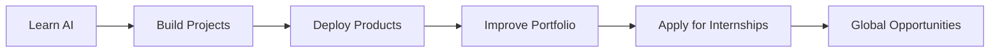

<div align="center">


<br/>


<br/>

<a href="https://anas-portfolio-pro.vercel.app/">
  
</a>
<a href="https://github.com/anabkl">
  
</a>
<a href="https://www.linkedin.com/in/anas-lahraoui-a772a5300/">
  
</a>
<a href="mailto:lahraouianas16@gmail.com">
  
</a>

<br/><br/>


</div>

---

<div align="center">

## ⚡ `whoami`

</div>


```yaml
name: Anas Lahraoui
username: anabkl
location: Morocco 🇲🇦
role: Computer Engineering & Artificial Intelligence Student
university: USMS Khouribga
focus:
  - Artificial Intelligence
  - Full-Stack Web Development
  - Mobile App Development
  - Data Science
  - Automation
  - Cybersecurity Fundamentals

currently_building:
  - AI-powered software products
  - Modern portfolio-grade web apps
  - Deep learning experiments
  - Real-world student projects

open_to:
  - Internships
  - Remote junior roles
  - AI collaborations
  - Open-source projects
```

<br clear="right"/>

---

<div align="center">

## 🧠 About Me

</div>

I am **Anas Lahraoui**, a Computer Engineering & Artificial Intelligence student from Morocco.
I like building projects that combine **AI, clean interfaces, automation, and real-world usefulness**.

My main direction is to become a strong **AI + Software Engineer** capable of building complete products from idea to deployment.

```txt
> I do not just learn technologies.
> I turn them into projects, demos, systems, and proof of work.
```

---

<div align="center">

## 🌌 My Digital Space

<a href="https://anas-portfolio-pro.vercel.app/">
  
</a>

<br/><br/>


</div>

---

<div align="center">

## 🛠️ Tech Arsenal

### Languages


### Frontend / Mobile


### Backend / Data / Tools


</div>

---

<div align="center">

## 🚀 Featured Projects

</div>

<table>
<tr>
<td width="50%">

<h3 align="center">📈 Lahraoui NeuralForex Pro</h3>

<p align="center">
Professional deep learning Forex predictor for EUR/USD combining LSTM time-series forecasting and NLP sentiment analysis.
</p>

<p align="center">


</p>

</td>
<td width="50%">

<h3 align="center">🧠 DL Studio</h3>

<p align="center">
Interactive learning platform for Deep Learning in French, designed for students and practical AI education.
</p>

<p align="center">


</p>

</td>
</tr>

<tr>
<td width="50%">

<h3 align="center">🧾 FiduExtract AI</h3>

<p align="center">
AI-oriented document extraction and automation system focused on structured data workflows.
</p>

<p align="center">


</p>

</td>
<td width="50%">

<h3 align="center">⚙️ LahraCore OS</h3>

<p align="center">
Experimental AI-native distributed microkernel concept with Rust, WASM sandboxing, and resource-aware design.
</p>

<p align="center">


</p>

</td>
</tr>
</table>

---

<div align="center">

## 📊 GitHub Live Dashboard


<br/><br/>


<br/><br/>


</div>

---

<div align="center">

## 🏆 GitHub Achievements


</div>

---

<div align="center">

## 🐍 Contribution Snake

<picture>
  <source media="(prefers-color-scheme: dark)" srcset="https://raw.githubusercontent.com/anabkl/anabkl/output/github-contribution-grid-snake-dark.svg" />
  <source media="(prefers-color-scheme: light)" srcset="https://raw.githubusercontent.com/anabkl/anabkl/output/github-contribution-grid-snake.svg" />
  
</picture>

</div>

---

<div align="center">

## ⚙️ Current Mission

</div>



---

<div align="center">

## 🌍 Connect With Me

<a href="https://anas-portfolio-pro.vercel.app/">
  
</a>

<a href="https://www.linkedin.com/in/anas-lahraoui-a772a5300/">
  
</a>

<a href="mailto:anas.lahraoui@usms.ac.ma">
  
</a>

<a href="mailto:lahraouianas16@gmail.com">
  
</a>

<br/><br/>


</div>

---

<div align="center">


</div>


<!--
**anabkl/anabkl** is a ✨ _special_ ✨ repository because its `README.md` (this file) appears on your GitHub profile.

Here are some ideas to get you started:

- 🔭 I’m currently working on ...
- 🌱 I’m currently learning ...
- 👯 I’m looking to collaborate on ...
- 🤔 I’m looking for help with ...
- 💬 Ask me about ...
- 📫 How to reach me: ...
- 😄 Pronouns: ...
- ⚡ Fun fact: ...
-->
